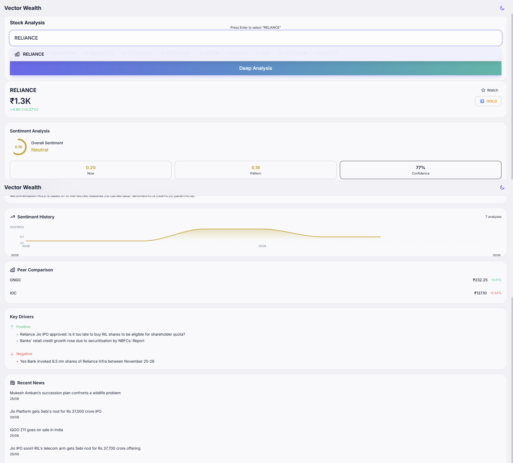
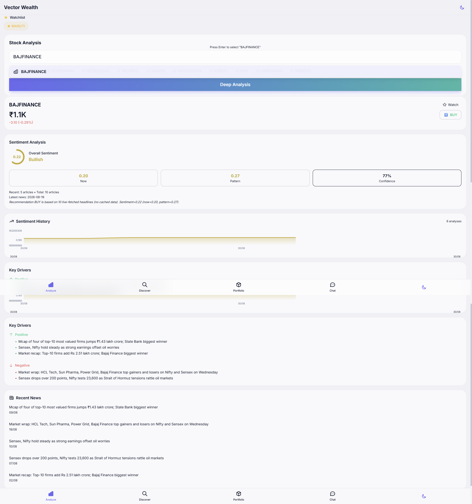
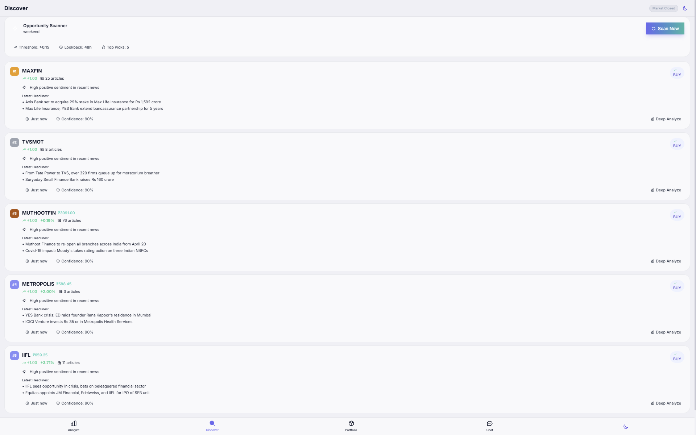
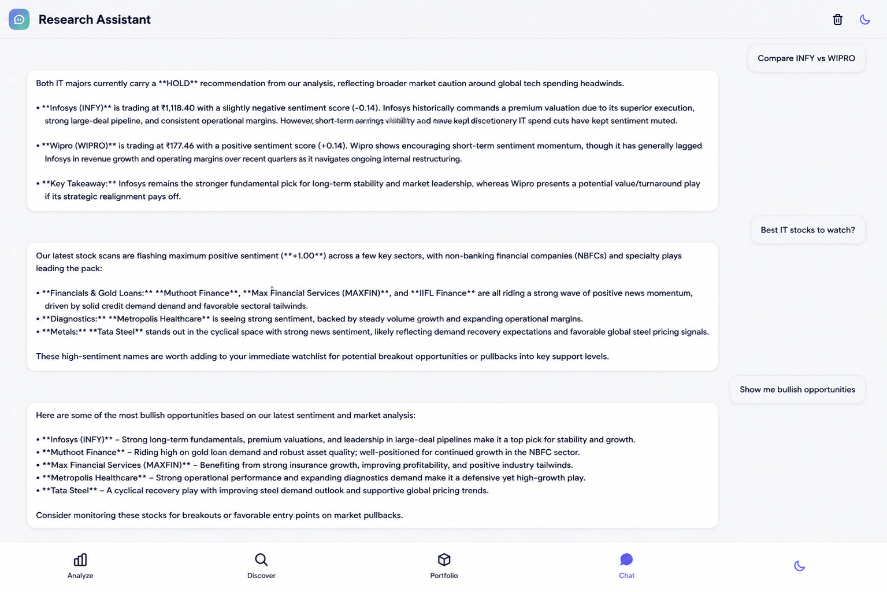
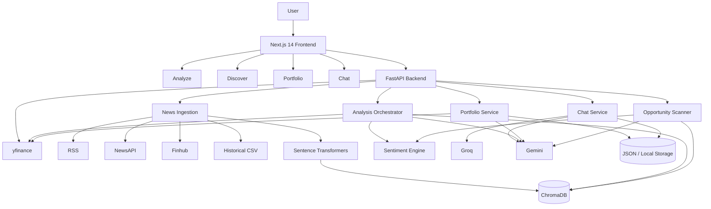

# Vector Wealth — AI Investment Intelligence Platform

> **An AI-powered investment research platform for the Indian stock market that combines explainable sentiment analysis, semantic news retrieval, live market intelligence, opportunity discovery, portfolio analytics, and conversational research.**

Vector Wealth is a full-stack financial intelligence application designed around a simple idea: investors should be able to move from **market information → relevant evidence → structured analysis → actionable research context** without switching between multiple tools.

The platform combines deterministic analytics with selectively applied LLM reasoning. Historical and live financial news are indexed into a local vector database, retrieved for ticker-specific analysis, scored through an explainable sentiment engine, enriched with market data, and surfaced through a modern Next.js interface. fileciteturn39file1L9-L29

---

## Demo

### Stock Analysis

The stock-analysis workflow brings together current price data, recent and historical sentiment, confidence, peer comparison, key drivers, and relevant news for an Indian equity.



**Description:** Reliance analysis showing ticker search, market price and daily change, overall/recent/pattern sentiment, confidence, sentiment history, peer comparison, positive/negative drivers, and recent headlines.



**Description:** Bajaj Finance analysis demonstrating the same end-to-end research pipeline with live headline retrieval, sentiment scoring, confidence estimation, historical trend visualization, and market context.

### Opportunity Discovery

The Discover workflow ranks potentially attractive stocks from recent market-news sentiment and presents them as research candidates.



**Description:** Opportunity Scanner showing ranked candidates, sentiment scores, article counts, BUY classifications, confidence, latest headlines, and links into deeper ticker analysis.

### AI Research Assistant

The conversational interface lets users ask questions about individual stocks, comparisons, sectors, market opportunities, and financial concepts.



**Description:** AI Research Assistant showing conversational stock research, comparison requests, opportunity queries, and natural-language market analysis.

---

# Overview

Indian retail investors often have access to prices, headlines, screeners, and financial information, but the research process remains fragmented.

Vector Wealth addresses this by combining:

- **Ticker analysis**
- **Historical + live financial news**
- **Semantic vector retrieval**
- **Explainable rule-based sentiment**
- **Optional LLM reasoning**
- **Market-price enrichment**
- **Opportunity scanning**
- **Goal-based portfolio tracking**
- **Conversational research**

The architecture is intentionally hybrid. A deterministic fast path handles retrieval, sentiment, confidence, and recommendation logic, while LLMs are used where language understanding and synthesis provide additional value. fileciteturn39file1L168-L183

---

# Key Features

## 1. AI-Assisted Stock Analysis

Enter an NSE/BSE ticker and Vector Wealth builds a structured research view containing:

- Current price
- Price change and percentage change
- Overall sentiment
- Recent sentiment
- Historical/pattern sentiment
- Confidence
- BUY / HOLD / SELL signal
- Positive and negative drivers
- Relevant news
- Peer comparison
- Sentiment history
- Optional AI summary

### Analysis flow

```text
Ticker
  ↓
Ticker extraction / normalization
  ↓
ChromaDB retrieval + local news search
  ↓
Deduplication
  ↓
Recent vs historical split
  ↓
On-demand live-news fallback
  ↓
Sentiment calculation
  ↓
Confidence + drivers + explanation
  ↓
Price + peers + AI summary
  ↓
AnalysisResult
```

The backend analysis flow is implemented through `main.py` → `agents.run_analysis()` → retrieval → sentiment → enrichment → typed response. fileciteturn39file1L168-L183

---

## 2. Explainable Sentiment Engine

Vector Wealth does not rely on a black-box LLM for every sentiment decision.

The rule-based sentiment engine supports:

- Weighted positive and negative terms
- Intensifiers
- Negation
- Contrast handling
- Numeric magnitude
- Segment weighting
- Recency effects
- Source-quality weighting
- Positive/negative driver extraction

### Sentiment processing

```text
Article
  ↓
Contrast segmentation
  ↓
Tokenization
  ↓
Positive / negative term matching
  ↓
Weighting
  ├─ term weights
  ├─ intensifiers
  ├─ negation
  └─ numeric magnitude
  ↓
Weighted segment score
  ↓
Recency / source weighting
  ↓
Final article sentiment
```

The score is clamped to `[-1, 1]`, keeping the output easy to interpret.

### Aggregation

```text
now_sentiment
    = average(recent article sentiment)

pattern_sentiment
    = time-decay weighted historical sentiment
      × source quality

sentiment
    = 0.7 × now_sentiment
      + 0.3 × pattern_sentiment
```

When recent evidence is unavailable, the historical component receives additional influence. fileciteturn39file1L293-L304

### Recommendation thresholds

```text
BUY   >=  0.20
SELL  <= -0.20
HOLD  otherwise
```

Confidence combines recent-news coverage with historical evidence. fileciteturn39file1L293-L304

---

## 3. Semantic Financial-News Search

News is represented as vectors using a local Sentence Transformers model and stored in ChromaDB.

### Retrieval sources

```text
Historical CSV
      +
NewsAPI
      +
Finnhub
      +
RSS
      ↓
Ticker tagging
      ↓
Sentence Transformer embeddings
      ↓
ChromaDB
```

Default embedding model:

```text
sentence-transformers/all-MiniLM-L6-v2
```

Properties:

| Property | Value |
|---|---|
| Embedding dimension | 384 |
| Device | CPU |
| Collection | `market_news_v2` |
| Batch size | 64 |
| Similarity | Normalized / cosine |
| Storage | Persistent ChromaDB |

The vector layer uses deterministic ingestion IDs and stores metadata such as dates, titles, provider information, and ticker tags. fileciteturn39file1L246-L264

---

## 4. Hybrid News Ingestion

Vector Wealth supports historical indexing and live ingestion.

### Historical pipeline

```text
IndianFinancialNews.csv
        ↓
CSV ingestion
        ↓
Ticker alias detection
        ↓
Deterministic IDs
        ↓
Batch embeddings
        ↓
ChromaDB
```

### Live pipeline

```text
LiveNewsIngestor
      │
      ├── RSS
      ├── NewsAPI
      └── Finnhub
      │
      ▼
Deduplication
      │
      ▼
Ticker tagging
      │
      ▼
Embeddings
      │
      ▼
ChromaDB
```

The live ingestion pipeline is configurable and uses sector rotation so that different market sectors receive coverage across successive ingestion cycles. fileciteturn39file1L188-L227

### Sector rotation

Example sector queries include:

```text
Banking
IT
Auto
Pharma
Oil & Gas
...
```

The active sector query changes between ingestion cycles to distribute coverage. fileciteturn39file1L216-L227

---

## 5. AI Research Assistant

The chat interface turns the platform into a conversational market-research workspace.

Users can ask for:

- Single-stock analysis
- Stock comparisons
- Portfolio context
- Bullish opportunities
- Sector research
- Financial concept explanations

The system uses internal intent tags to route requests into the relevant data workflows. fileciteturn39file1L326-L337

### Chat routing

```text
User message
      ↓
LLM intent detection
      ↓
┌────────────────────────────────┐
│ ANALYZE:TICKER                 │
│ COMPARE:T1,T2                  │
│ WATCHLIST                      │
│ PORTFOLIO                      │
│ OPPORTUNITIES                  │
│ DIRECT                         │
└────────────────────────────────┘
      ↓
Relevant service / analysis
      ↓
Context-aware response
```

### Provider fallback

```text
Groq
  ↓
timeout / failure
  ↓
Gemini
```

The architecture uses Groq as the primary chat provider and Gemini as fallback. fileciteturn39file1L308-L337

---

## 6. Opportunity Discovery

The Discover page uses a two-stage opportunity scanner.

### Stage 1 — Deterministic filtering

```text
Recent news
    ↓
Ticker grouping
    ↓
Sentiment calculation
    ↓
Threshold filtering
    ↓
Top candidate set
```

### Stage 2 — LLM selection

```text
Candidate set
    ↓
Gemini
    ↓
Top BUY opportunities
    ↓
Reasoning + confidence
    ↓
Price enrichment
```

The default scanner configuration includes a `0.15` sentiment threshold, up to `20` candidates, and a target of `5` final opportunities. fileciteturn39file1L398-L429

This keeps the LLM workload focused on a smaller, higher-quality candidate set instead of reasoning over the entire news universe.

---

## 7. Goal-Based Portfolio Management

Users can create investment goals and attach stock holdings to them.

### Goal model

```text
Goal
├── id
├── name
├── targetAmount
├── targetDate
├── riskTolerance
└── holdings[]
      ├── ticker
      ├── quantity
      ├── buyPrice
      └── buyDate
```

### Computed portfolio metrics

- Total invested
- Current value
- P&L
- P&L percentage
- Goal progress
- Years remaining

Portfolio analysis fetches market prices in parallel and can use Gemini to generate goal-aware suggestions and recommended stocks. fileciteturn39file1L342-L372

---

# System Architecture



---

# End-to-End Research Flow

A typical analysis request travels through the system as follows:

```text
1. User enters ticker
          ↓
2. Next.js sends POST /analyze
          ↓
3. FastAPI validates request
          ↓
4. Analysis orchestrator identifies ticker
          ↓
5. Retrieve relevant news
          ├── ChromaDB semantic retrieval
          └── local historical search
          ↓
6. Deduplicate results
          ↓
7. Split recent vs historical evidence
          ↓
8. Fetch on-demand news when required
          ↓
9. Run sentiment analysis
          ↓
10. Compute confidence and drivers
          ↓
11. Fetch current market price
          ↓
12. Fetch peer prices
          ↓
13. Generate optional AI summary
          ↓
14. Return structured AnalysisResult
          ↓
15. Next.js renders research dashboard
```

---

# AI / LLM Architecture

| Capability | Provider | Model | Role |
|---|---|---|---|
| GenAI analysis | Google | Gemini 2.5 Flash | Optional LangGraph reasoning |
| AI summary | Google | Gemini 2.5 Flash | Short research summary |
| Chat | Groq | Llama 3.3 70B | Primary conversational model |
| Chat fallback | Google | Gemini 2.5 Flash | Provider fallback |
| Opportunity scanner | Google | Gemini 2.5 Flash | Candidate selection |
| Portfolio suggestions | Google | Gemini 2.5 Flash | Goal-aware recommendations |

### LangGraph path

```text
Scout Agent
    ↓
Analyst / Advisor Agent
    ↓
Structured JSON
    ↓
Market-data enrichment
```

The deterministic fast analysis path remains available through `USE_GENAI_ANALYSIS=false`, reducing unnecessary LLM dependency for routine analysis. fileciteturn39file1L308-L323

---

# Frontend Architecture

The web application uses the Next.js App Router.

| Technology | Version / Role |
|---|---|
| Next.js | 14.2.0 |
| React | 18.3.0 |
| TypeScript | 5.4.0 |
| Tailwind CSS | 3.4.3 |
| Recharts | 2.12.0 |
| Zustand | 4.5.0 |
| Inter | Typography |
| Inline SVG | Icons |

### Routes

| Route | Purpose |
|---|---|
| `/` | Redirect to analysis |
| `/analyze` | Stock analysis |
| `/discover` | Opportunity scanner |
| `/portfolio` | Goal-based portfolio |
| `/chat` | AI research assistant |
| `/settings` | Backend/theme configuration |

These routes and their primary components are documented in the technical audit. fileciteturn39file1L98-L117

### State management

The frontend uses React Context for domain state and Zustand for lightweight persistent stores.

```text
React Context
├── Theme
├── Analysis
├── Discover
├── Portfolio
└── Chat

Zustand
├── Watchlist
└── Trends
```

Browser persistence is used for theme, watchlist, trends, recent tickers, and user-local state. fileciteturn39file1L108-L117

---

# Backend Architecture

| Module | Responsibility |
|---|---|
| `main.py` | FastAPI application, routing, CORS, rate limiting |
| `agents.py` | Analysis orchestration |
| `sentiment.py` | Rule-based sentiment and drivers |
| `price_service.py` | yfinance market-price access |
| `opportunity_scanner.py` | Opportunity detection |
| `portfolio_service.py` | Portfolio analysis + AI suggestions |
| `chat_service.py` | Conversational routing + provider fallback |
| `live_news_ingest.py` | Live news ingestion |
| `ingest_data.py` | Historical CSV ingestion |
| `embedding_service.py` | Sentence Transformer embeddings |
| `storage_service.py` | JSON persistence |
| `stock_data.py` | Stock aliases, peers, sectors |
| `ai_summary.py` | Gemini research summaries |

The backend module responsibilities are defined in the audit report's responsibility matrix. fileciteturn39file1L143-L166

---

# API

| Method | Endpoint | Purpose |
|---|---|---|
| `GET` | `/` | Health / service information |
| `POST` | `/analyze` | Analyze ticker |
| `GET` | `/opportunities` | Retrieve opportunities |
| `POST` | `/opportunities/scan` | Run scanner |
| `GET` | `/opportunities/status` | Scanner status |
| `POST` | `/chat` | Send research question |
| `GET` | `/chat/history/{sid}` | Retrieve chat history |
| `POST` | `/portfolio/analyze` | Analyze goals/holdings |
| `POST` | `/portfolio/suggest` | Generate goal suggestions |
| `POST` | `/storage/portfolio/save` | Save portfolio |
| `GET` | `/storage/portfolio/load` | Load portfolio |
| `POST` | `/storage/chat/save` | Save chat |
| `GET` | `/storage/chat/load` | Load chat |
| `GET` | `/admin/live-news/status` | Live-news status |
| `POST` | `/admin/live-news/refresh` | Trigger ingestion |
| `POST` | `/admin/live-news/retag-existing` | Re-tag stored news |

The backend currently exposes the analysis, scanner, portfolio, chat, storage, and live-news administration surfaces listed above. fileciteturn39file1L447-L465

---

# Data Storage

| Storage | Purpose |
|---|---|
| ChromaDB | News vectors and metadata |
| `portfolios.json` | Portfolio goals and holdings |
| `chat_history.json` | Chat sessions |
| `opportunities.json` | Scanner output |
| `historical_ingest_state.json` | Historical ingest progress |
| `live_ingest_state.json` | Live ingest state |
| Browser localStorage | Theme, watchlist, trends and local UI state |

The current design uses persistent local storage rather than a managed distributed database. fileciteturn39file1L433-L443

---

# Performance & Reliability

Vector Wealth includes several practical optimization layers.

### Market data

- 5-minute successful-price cache
- Short-lived failure cache
- NSE → BSE fallback behavior

### Embeddings

- Batch embedding
- Local CPU execution
- Persistent ChromaDB
- Deterministic IDs

### Portfolio

- Parallel holding-price retrieval

### Scanner

- Deterministic candidate reduction before LLM selection

### Frontend

- Request retry
- Request timeout
- Skeleton loading
- Typed API errors

These mechanisms are documented in the performance and error-handling sections of the audit report. fileciteturn39file1L557-L595

---

# Error Handling

The application is designed to degrade gracefully when individual dependencies fail.

```text
External Provider Failure
        ↓
Provider / cache fallback
        ↓
Continue with available data
        ↓
Return structured response
```

Examples include:

- Groq → Gemini fallback
- yfinance fallback/cache behavior
- Per-batch ingestion isolation
- Resumable ingestion
- Frontend retry
- Typed API errors
- Null-safe financial formatting

fileciteturn39file1L557-L566

---

# Security

Current security controls include:

- API keys loaded through environment variables
- `.env` excluded from source control
- Optional admin API key
- Configurable CORS
- In-memory rate limiting
- Frontend environment limited to `NEXT_PUBLIC_*` configuration

The current system does **not** implement full user authentication and uses an application-level API architecture rather than a multi-user identity system. fileciteturn39file1L571-L579

---

# Environment Variables

Create a local `.env` file and configure the required credentials.

```env
GOOGLE_API_KEY=your_google_key
GROQ_API_KEY=your_groq_key

NEWSAPI_KEY=your_newsapi_key
FINNHUB_API_KEY=your_finnhub_key

GROQ_MODEL=llama-3.3-70b-versatile
GROQ_BASE_URL=https://api.groq.com/openai/v1

ALLOWED_ORIGINS=*
ADMIN_API_KEY=your_admin_key

RATE_LIMIT_MAX=10
RATE_LIMIT_WINDOW=60

USE_GENAI_ANALYSIS=false
ENABLE_AI_SUMMARY=true

LIVE_NEWS_ENABLED=false
LIVE_NEWS_PROVIDER=newsapi,rss
LIVE_NEWS_INTERVAL_MINUTES=30

USE_SECTOR_ROTATION=true
USE_INDIA_DOMAINS=true
RSS_ENABLED=true

EMBEDDING_MODEL=all-MiniLM-L6-v2
EMBEDDING_DEVICE=cpu
CHROMA_COLLECTION_NAME=market_news_v2
VECTOR_WEALTH_DB_PATH=./vector_wealth_db

FAST_NEWS_MAX_AGE_DAYS=30
FAST_NEWS_MAX_CANDIDATES=120
```

At least one of `GOOGLE_API_KEY` or `GROQ_API_KEY` is required for the supported AI workflows, while live-news providers are optional. fileciteturn39file1L470-L504

**Never commit `.env` or real API keys.**

---

# Local Setup

## Prerequisites

- Python 3.13
- Node.js / npm
- Git

## 1. Clone

```bash
git clone https://github.com/abhishek24-06/Vector-Wealth-AI-Investment-Intelligence-Platform.git

cd Vector-Wealth-AI-Investment-Intelligence-Platform
```

## 2. Backend

Create a virtual environment:

### Windows PowerShell

```powershell
python -m venv .venv
.\.venv\Scripts\Activate.ps1
```

Install dependencies:

```powershell
cd backend
pip install -r requirements.txt
```

Start FastAPI:

```powershell
uvicorn main:app --reload
```

Backend:

```text
http://127.0.0.1:8000
```

Interactive API documentation:

```text
http://127.0.0.1:8000/docs
```

## 3. Frontend

Open a second terminal:

```powershell
cd frontend-next
npm install
npm run dev
```

Frontend:

```text
http://localhost:3000
```

## 4. Verify production build

```powershell
npm run build
```

The current Next.js frontend build is passing according to the project audit. fileciteturn39file1L599-L613

---

# Historical Data Ingestion

The historical news corpus is ingested into ChromaDB using the backend ingestion pipeline.

```text
Historical CSV
      ↓
ingest_data.py
      ↓
Ticker tagging
      ↓
Batch embeddings
      ↓
ChromaDB
```

The ingestion flow is designed to support deterministic IDs, deduplication, and resumability. fileciteturn39file1L190-L213

---

# Live News Ingestion

Live ingestion can be enabled through:

```env
LIVE_NEWS_ENABLED=true
```

Supported providers include:

- RSS
- NewsAPI
- Finnhub

The ingestion service is configurable around:

- polling interval
- lookback window
- page size
- maximum articles per run
- sector rotation
- India-specific domains
- provider selection

---

# Deployment

## Backend

The backend is containerized for deployment and includes Render configuration.

```text
Render
  ↓
Docker
  ↓
Gunicorn
  ↓
Uvicorn worker
  ↓
FastAPI
```

The current backend deployment configuration uses Python 3.13, a Docker image, Gunicorn with a Uvicorn worker, and port `10000`. fileciteturn39file1L508-L531

## Frontend

The Next.js application currently builds successfully but does not yet include a dedicated production deployment configuration.

Potential deployment targets:

- Vercel
- Netlify
- Cloudflare Pages
- Container hosting

The technical audit identifies frontend deployment configuration as remaining work. fileciteturn39file1L534-L538

---

# Testing

Current backend test coverage includes areas such as:

```text
backend/tests/test_api.py
tests/test_sentiment.py
tests/test_ticker.py
test_ingest.py
test_chromadb*.py
test_scanner.py
```

Coverage includes:

- API behavior
- Sentiment
- Ticker extraction and aliases
- Historical ingestion
- ChromaDB operations
- Scanner logic

The current testing gap is frontend, E2E, and full-stack integration coverage. fileciteturn39file1L542-L553

---

# Project Structure

```text
Vector-Wealth-AI-Investment-Intelligence-Platform/
│
├── backend/
│   ├── main.py
│   ├── agents.py
│   ├── sentiment.py
│   ├── price_service.py
│   ├── opportunity_scanner.py
│   ├── portfolio_service.py
│   ├── chat_service.py
│   ├── live_news_ingest.py
│   ├── ingest_data.py
│   ├── embedding_service.py
│   ├── storage_service.py
│   ├── stock_data.py
│   ├── ai_summary.py
│   └── requirements.txt
│
├── frontend-next/
│   ├── app/
│   ├── components/
│   ├── lib/
│   ├── providers/
│   ├── package.json
│   └── next.config.js
│
├── data/
│   └── IndianFinancialNews.csv
│
├── docs/
│   └── images/
│       ├── stock-analysis-reliance.png
│       ├── stock-analysis-bajaj-finance.png
│       ├── opportunity-scanner.png
│       └── ai-research-chat.png
│
├── Dockerfile
├── render.yaml
├── .env.example
├── .gitignore
└── README.md
```

---

# Key Engineering Decisions

## Why a hybrid architecture?

Not every research query needs an LLM.

The platform therefore separates:

```text
Deterministic work
├── Retrieval
├── Sentiment
├── Confidence
├── Recommendation thresholds
└── Candidate filtering

LLM work
├── Language understanding
├── Research synthesis
├── Chat
├── Opportunity selection
└── Portfolio suggestions
```

This keeps routine operations predictable while still benefiting from generative reasoning where appropriate. fileciteturn39file1L634-L645

---

## Why local embeddings?

Using `all-MiniLM-L6-v2` locally provides:

- CPU execution
- 384-dimensional vectors
- No hosted embedding dependency for the core retrieval layer
- Batch processing
- Persistent local storage

This was a deliberate engineering tradeoff to keep semantic retrieval practical and inexpensive. fileciteturn39file1L246-L257

---

## Why combine historical and live news?

Historical news supplies context and pattern evidence.

Live news supplies current information.

The analysis pipeline therefore distinguishes:

```text
NOW
↓
Recent matched headlines

PATTERN
↓
Historical contextual evidence
```

This lets the application remain useful even when current headline coverage is sparse, while still preferring recent evidence when it is available. fileciteturn39file1L236-L240

---

## Why use provider fallback?

External AI services are not guaranteed to be continuously available.

The chat architecture therefore uses:

```text
Groq
  ↓
failure / timeout
  ↓
Gemini
```

while deterministic fallback behavior is used in other workflows where possible. fileciteturn39file1L314-L337


# Engineering Highlights

### Hybrid Analysis Pipeline

A deterministic fast path combines local retrieval, explainable sentiment, confidence calculation, and market-data enrichment, with an optional GenAI path for deeper reasoning.

### Local Semantic Retrieval

Sentence Transformer embeddings are generated locally and persisted in ChromaDB, reducing dependency on external embedding services.

### Multi-Source Financial News

Historical CSV data, RSS, NewsAPI, and Finnhub can contribute to the platform's financial-news intelligence layer.

### Idempotent Ingestion

Deterministic IDs and persisted ingestion state reduce duplicate inserts and allow ingestion to resume.

### Hybrid Opportunity Scanner

A deterministic filter narrows a larger candidate space before LLM-based selection.

### Provider Failover

Groq → Gemini provides resilience for conversational AI.

### Goal-Based Portfolio Intelligence

Portfolio analysis combines prices, P&L, risk context, sentiment, and LLM-generated suggestions.

### Typed Frontend / Backend Contract

TypeScript interfaces mirror backend response models to keep the UI/data boundary explicit.

These are among the main engineering achievements identified by the project audit. fileciteturn39file1L634-L646


# Disclaimer

Vector Wealth is a **software engineering and investment-research project**.

Its sentiment scores, recommendations, opportunity rankings, portfolio suggestions, and AI-generated responses are intended for **research and educational purposes only** and should not be treated as personalized financial advice.

Always verify important information independently and consult a qualified financial professional before making investment decisions.

---

# Author

**Abhishek Tajane**

GitHub: [@abhishek24-06](https://github.com/abhishek24-06)

---

# Project Status

**Feature-complete research platform with a working FastAPI backend and Next.js frontend.**

Vector Wealth demonstrates how:

```text
Financial News
      +
Semantic Retrieval
      +
Explainable Sentiment
      +
Market Data
      +
LLM Reasoning
      +
Portfolio Context
      ↓
Investment Intelligence
```

can be assembled into a single research workflow for the Indian stock market.
